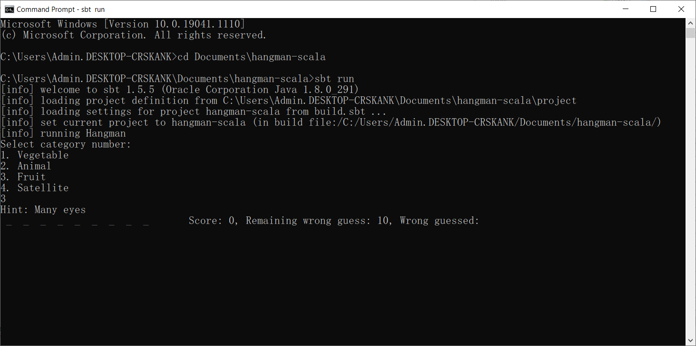

## Icon Kaset Assignment Test for Backend Engineer

โจทย์ข้อที่ 1 เขียนโปรแกรมด้วยภาษา Scala เพื่อสร้างเกม Hangman ใน Terminal/Console(Command Line Interface)
โดยมีความสามารถอย่างน้อยต่อไปนี้ เลือกหมวดหมู่ของคําได้ โดยเก็บคําในแต่ละหมวดหมู่แยกเป็นไฟล์หมวดหมู่ละ 1 ไฟล์ 
โปรแกรมที่ส่งมาให้ตรวจจะต้องมีหมวดหมู่อย่างน้อย 2 หมวดหมู่และมีคํา ในหมวดหมู่อย่างน้อยหมวดหมู่ละ 5 คํา 
“คํา” ที่ใช้เล่นเกม อาจประกอบด้วยช่องว่าง, ตัวเลข และสัญลักษณ์ แต่จะไม่เป็นส่วนหนึ่งของการเล่นเกม จะต้องแสดงผลทันที
(เช่น คําอาจจะเป็น “Singham 48!!” ก็จะแสดงผลว่า _ _ _ _ _ _ _ _ 48!! เป็นต้น) 
การเล่นเกมจะใช้ตัวอักษรภาษาอังกฤษเท่านั้น โดยเป็น case insensitive ทั้งหมด คําแต่ละคํา จะต้องประกอบด้วย “คําใบ้”
มีการแสดงตัวอักษรที่เดาผิด มีการคํานวนคะแนนจากการเล่นเดาคําในแต่ละรอบ โดยจะคํานวนคะแนนอย่างไรขึ้นกับผู้ทดสอบเลย (คิดเกณฑ์/อัลกอริทึมการให้คะแนนเอง)

## Set up
1. เปิด Terminal / Console(Command Line Interface) clone project hangman-scala 
2. `cd hangman-scala`
3. Install sbt (ถ้ามี sbt อยู่แล้วข้ามขั้นตอนนี้ไปได้เลย)
4. `sbt run` เพื่อทำการรันเกม Hangman

### Terminal/Console(Command Line Interface) จะแสดงดังนี้

